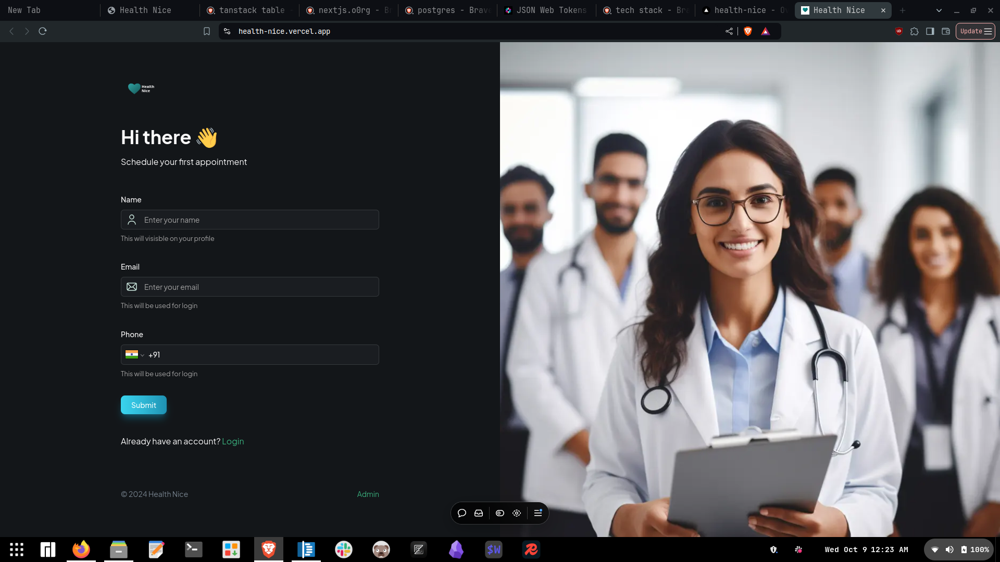
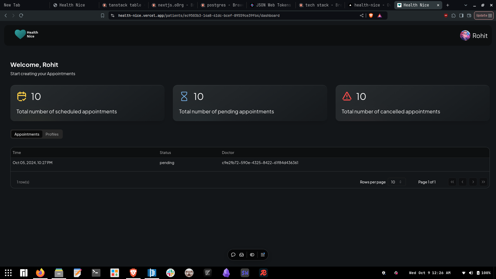
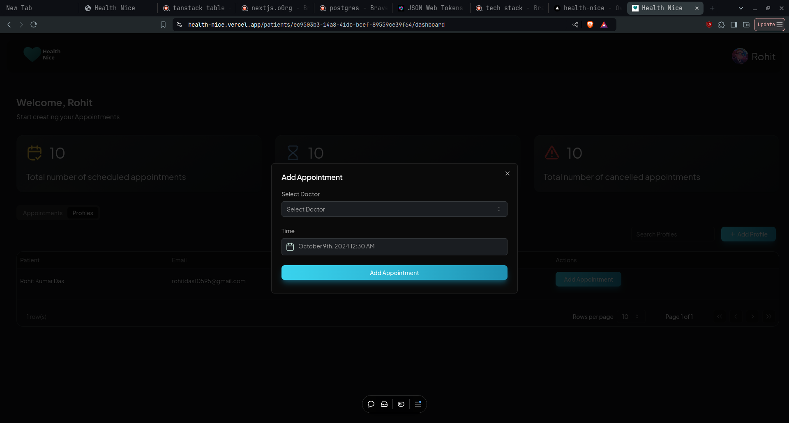

### This is Hospital patient management App.

The app is built with [Dirzzle ORM](https://orm.drizzle.team/) and [Next JS](https://nextjs.org/). This is a hospital management app.
The App is hosted on [Vercel](https://vercel.com/). The app uses [Vercel Blob](https://vercel.com/docs/storage/vercel-blob) to store files. The app uses [Tanstack Query](https://tanstack.com/query/latest) for queries. 


## App can be hosted  For Free
- Every  stack used  has free tier.

## Snapshots

1. Login page


2. Dashboard page


3. Add Appointment Modal


## Features

* Login
* Register
* Patient Profile
* Patient Dashboard
* Patient Appointment


## Tech Stack

| Stack Component | Component  Name                                                                                                |
| --------------- | --------------------------------------------------------------------------------------------------------------- |
| FrameWork       | [Next Js](https://nextjs.org "NextJs")                                                                                |
| Database        | [PostgreSQL](https://www.postgresql.org/ "PostgreSql")                                                                |
| ORM             | [Dirzzle ORM](https://orm.drizzle.team/)                                                                           |
| Cache           | [Redis](https://redis.io/)                                                                                         |
| Auth            | [JWT](https://jwt.io/) based [Cookie](https://nextjs.org/docs/app/api-reference/functions/cookies)                    |
| Actions         | [Server Actions](https://nextjs.org/docs/app/building-your-application/data-fetching/server-actions-and-mutations) |
| Queries         | [Tanstack Query](https://tanstack.com/query/latest)                                                                |
| Email           | [Resend](https://resend.com/)                                                                                      |
| Files           | [Vercel Blob](https://vercel.com/docs/storage/vercel-blob)                                                         |

## Enviroment Variebles

* Set  the following environment variables with  your own values

  ```.env

  POSTGRES_USER=""
  POSTGRES_HOST=""
  POSTGRES_PASSWORD=""
  POSTGRES_DATABASE=""
  NEXTAUTH_SECRET=""
  REDIS_HOST=""
  REDIS_PORT=""
  REDIS_PASSWORD=""
  REDIS_USERNAME=""
  RESEND_API_KEY=""
  BLOB_READ_WRITE_TOKEN=""
  JWT_SECRET=""
  ```

## Database Schema

```ts
import { sql } from "drizzle-orm";
import {
  pgSchema,
  uuid,
  varchar,
  text,
  timestamp,
  bigint,
  PgTableWithColumns,
  PgColumn,
  doublePrecision,
  integer,
  boolean,
  pgEnum,
  json,
  date,
} from "drizzle-orm/pg-core";
import { spec } from "node:test/reporters";

export const schema = pgSchema("health_nice");

export enum Gender {
  Male = "male",
  Female = "female",
  Other = "other",
}


export enum AppointmentStatus{
  Pending = "pending",
  Confirmed = "confirmed",
  Completed = "completed",
  Cancelled = "cancelled"
}


export const Doctor = schema.table("doctor", {
  id: uuid("pk").primaryKey().notNull().defaultRandom(),
  email: varchar("email", { length: 100 }).notNull().unique(),
  phone: varchar("phone", { length: 100 }).notNull(),
  password: varchar("password", { length: 100 }),
  name: varchar("name", { length: 255 }),
  specialization: json("specialization").default(null),
  experience: integer("experience").default(0),
  fees: doublePrecision("fees").default(0),
  address: varchar("address", { length: 255 }),
  avatar: varchar("avatar", { length: 255 }),
  createdAt: timestamp("created_at").defaultNow().notNull(),
  updatedAt: timestamp("updated_at")
    .defaultNow()
    .notNull()
    .$onUpdateFn(() => sql`CURRENT_TIMESTAMP`),
});

export const DoctorSession = schema.table("doctor_session", {
  id: uuid("pk").primaryKey().notNull().defaultRandom(),
  doctorId: uuid("doctor_id")
    .notNull()
    .references(() => Doctor.id),
  activeExpires: bigint("active_expires", { mode: "number" }).notNull(),
  idleExpires: bigint("idle_expires", { mode: "number" }).notNull(),
  createdAt: timestamp("created_at").defaultNow().notNull(),
  updatedAt: timestamp("updated_at")
    .defaultNow()
    .notNull()
    .$onUpdateFn(() => sql`CURRENT_TIMESTAMP`),
});

export const Patient = schema.table("patient", {
  id: uuid("pk").primaryKey().notNull().defaultRandom(),
  email: varchar("email", { length: 100 }).notNull().unique(),
  phone: varchar("phone", { length: 100 }).notNull(),
  password: varchar("password", { length: 100 }),
  name: varchar("name", { length: 255 }),
  createdAt: timestamp("created_at").defaultNow().notNull(),
  updatedAt: timestamp("updated_at")
    .defaultNow()
    .notNull()
    .$onUpdateFn(() => sql`CURRENT_TIMESTAMP`),
});

export const PatientData = schema.table("patient_data", {
  id: uuid("pk").primaryKey().notNull().defaultRandom(),
  patientId: uuid("patient_id")
    .notNull()
    .references(() => Patient.id),
  name: varchar("name", { length: 255 }),
  email: varchar("email", { length: 100 }).notNull().unique(),
  phone: varchar("phone", { length: 100 }).notNull(),
  birthDate: date("birth_date").notNull(),
  gender: varchar("gender", { enum: ["male", "female", "other"] }).notNull(),
  address: varchar("address"),
  occupation: varchar("occupation"),
  emergencyContactName: varchar("emergency_contact_name"),
  emergencyContactNumber: varchar("emergency_contact_number", { length: 25 }),
  primaryPhysicianId: uuid("primary_physician_id")
    .notNull()
    .references(() => Doctor.id),
  insuranceProvider: varchar("insurance_provider"),
  insurancePolicyNumber: varchar("insurance_policy_number", { length: 25 }),
  allergies: varchar("allergies"),
  currentMedication: varchar("current_medication"),
  familyMedicalHistory: varchar("family_medical_history"),
  pastMedicalHistory: varchar("past_medical_history"),
  identificationType: varchar("identification_type"),
  identificationNumber: varchar("identification_number"),
  identificationDocument: json("identification_document").default(null),
  treatmentConsent: boolean("treatment_consent").default(false),
  disclosureConsent: boolean("disclosure_consent").default(false),
  privacyConsent: boolean("privacy_consent").default(false),
  createdAt: timestamp("created_at").defaultNow().notNull(),
  updatedAt: timestamp("updated_at")
    .defaultNow()
    .notNull()
    .$onUpdateFn(() => sql`CURRENT_TIMESTAMP`)
    .$onUpdateFn(() => sql`CURRENT_TIMESTAMP`),
});

export const PatientSession = schema.table("patient_session", {
  id: uuid("pk").primaryKey().notNull().defaultRandom(),
  patientId: uuid("patient_id")
    .notNull()
    .references(() => Patient.id),
  activeExpires: bigint("active_expires", { mode: "number" }).notNull(),
  idleExpires: bigint("idle_expires", { mode: "number" }).notNull(),
  createdAt: timestamp("created_at").defaultNow().notNull(),
  updatedAt: timestamp("updated_at")
    .defaultNow()
    .notNull()
    .$onUpdateFn(() => sql`CURRENT_TIMESTAMP`),
});

export const Appointments = schema.table("appointments", {
  id: uuid("pk").primaryKey().notNull().defaultRandom(),
  patientId: uuid("patient_id")
    .notNull()
    .references(() => Patient.id),
  patientDataId: uuid("patient_data_id")
    .notNull()
    .references(() => PatientData.id),
  doctorId: uuid("doctor_id")
    .notNull()
    .references(() => Doctor.id),
  time: timestamp("time").notNull(),
  status: varchar("status", { length: 100, enum: ["pending", "confirmed", "completed", "cancelled"]}).notNull(),
  createdAt: timestamp("created_at").defaultNow().notNull(),
  updatedAt: timestamp("updated_at").defaultNow().notNull().$onUpdateFn(() => sql`CURRENT_TIMESTAMP`),
});

export const AdminRole = schema.table("admin_role", {
  id: uuid("pk").primaryKey().notNull().defaultRandom(),
  name: varchar("name", { length: 100 }).unique().notNull(),
  createdAt: timestamp("created_at").defaultNow().notNull(),
  updatedAt: timestamp("updated_at")
    .defaultNow()
    .notNull()
    .$onUpdateFn(() => sql`CURRENT_TIMESTAMP`),
});

export const Permission = schema.table("permission", {
  id: uuid("pk").primaryKey().notNull().defaultRandom(),
  name: varchar("name", { length: 100 }).unique().notNull(),
  createdAt: timestamp("created_at").defaultNow().notNull(),
  updatedAt: timestamp("updated_at")
    .defaultNow()
    .notNull()
    .$onUpdateFn(() => sql`CURRENT_TIMESTAMP`),
});

export const AdminRolePermission = schema.table("admin_role_permission", {
  id: uuid("pk").primaryKey().notNull().defaultRandom(),
  adminRoleId: uuid("admin_role_id")
    .notNull()
    .references(() => AdminRole.id),
  permissionId: uuid("permission_id")
    .notNull()
    .references(() => Permission.id),
  createdAt: timestamp("created_at").defaultNow().notNull(),
  updatedAt: timestamp("updated_at")
    .defaultNow()
    .notNull()
    .$onUpdateFn(() => sql`CURRENT_TIMESTAMP`),
});

export const Admin = schema.table("admin", {
  id: uuid("pk").primaryKey().notNull().defaultRandom(),
  email: varchar("email", { length: 100 }).notNull().unique(),
  password: varchar("password", { length: 100 }).notNull(),
  adminRoleId: uuid("admin_role_id")
    .notNull()
    .references(() => AdminRole.id),
  createdAt: timestamp("created_at").defaultNow().notNull(),
  updatedAt: timestamp("updated_at")
    .defaultNow()
    .notNull()
    .$onUpdateFn(() => sql`CURRENT_TIMESTAMP`),
});

export const AdminSession = schema.table("admin_session", {
  id: uuid("pk").primaryKey().notNull().defaultRandom(),
  adminId: uuid("admin_id")
    .notNull()
    .references(() => Admin.id),
  activeExpires: bigint("active_expires", { mode: "number" }).notNull(),
  idleExpires: bigint("idle_expires", { mode: "number" }).notNull(),
  createdAt: timestamp("created_at").defaultNow().notNull(),
  updatedAt: timestamp("updated_at")
    .defaultNow()
    .notNull()
    .$onUpdateFn(() => sql`CURRENT_TIMESTAMP`),
});

export const AdminKey = schema.table("admin_key", {
  id: uuid("pk").primaryKey().notNull().defaultRandom(),
  hashedPassword: varchar("hashed_password", { length: 100 }).notNull(),
  adminId: uuid("admin_id")
    .notNull()
    .references(() => Admin.id),
  createdAt: timestamp("created_at").defaultNow().notNull(),
  updatedAt: timestamp("updated_at")
    .defaultNow()
    .notNull()
    .$onUpdateFn(() => sql`CURRENT_TIMESTAMP`),
});

export type DbTables =
  | typeof AdminRole
  | typeof Patient
  | typeof PatientSession
  | typeof Permission
  | typeof AdminRolePermission
  | typeof Admin
  | typeof AdminKey
  | typeof AdminSession
  | typeof Doctor
  | typeof DoctorSession;

```

## Getting Started

First, run the development server:

```bash
npm run dev
# or
yarn dev
# or
pnpm dev
# or
bun dev
```

## Learn More About Next.js

To learn more about Next.js, take a look at the following resources:

- [Next.js Documentation](https://nextjs.org/docs) - learn about Next.js features and API.


## Deploy on Vercel


Check out our [Next.js deployment documentation](https://nextjs.org/docs/app/building-your-application/deploying) for more details.
